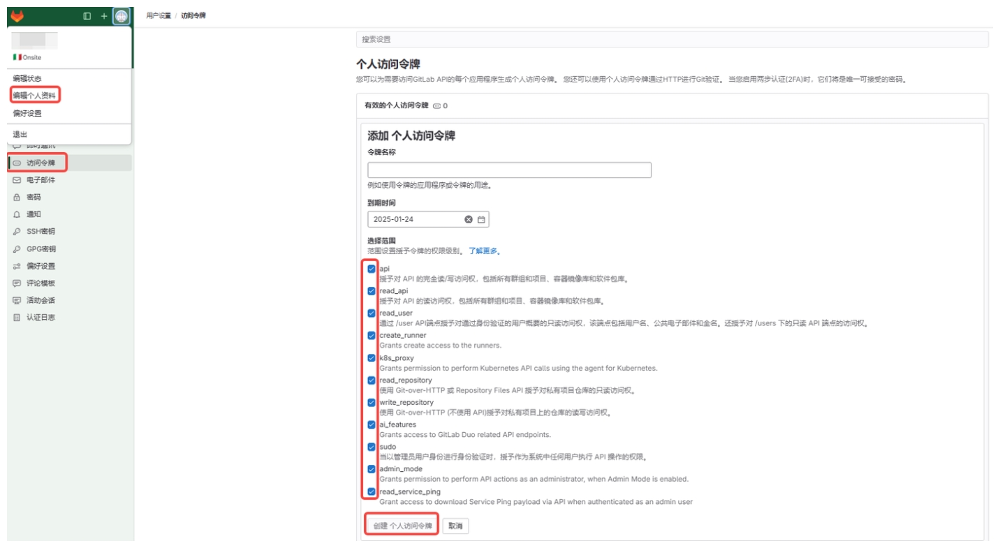
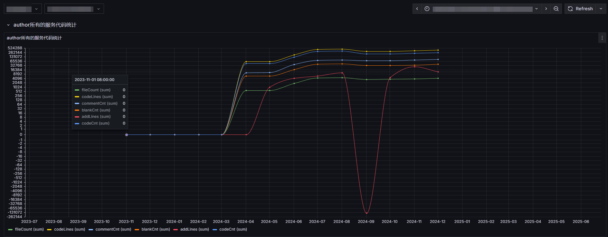

# Contribute Analyzer
## Description:
This project primarily focuses on analyzing and managing statistics related to your programming codebase. It is devised to dissect the intricate code and give useful metrics, thereby enhancing debugging and improving overall code efficiency. By using this code analysis tool, you can keep track of your code, maintain high standards, and be aware of any anomalies as early as possible to refactor it promptly.

## Documentation
https://docs.gitlab.com/ee/api/commits.html

## Author
Author: Jackyee Hua  
Date: 2024-12-23 15:30  
Mail: hey.jackyee@gmail.com

## Getting Started 

To run this project locally you need to follow these instructions:

Step 1. Clone the project in your workspace.

```bash
cd ~ && git clone https://github.com/JackyeeMe/ContributeAnalyzer.git
```

Step 2. Navigate to workspace and install dependencies.

```bash
cd ~/ContributeAnalyzer && npm install moment
```

Step 3. Reconfigure gitlab.js
```bash
const GITLAB_TOKEN = 'fill in gitlab token';
const GITLAB_HOST = 'fill in gitlab host';
```
**Where is my gitlab token?**



Step 4. Confirm analyze time range from gitlab in month.js
```bash
const months = [13, 12, 11, 10, 9, 8, 7, 6, 5, 4, 3, 2, 1, 0]; // default recent 1 year
```

Step 5. Reconfigure your projects in config.js
```bash
/**
 * @brief: config your projects here
 * 
 * id: project id in gitlab
 * path: project path in local
 */
const projects = {
    backend_power: {
        id: 1,
        path: '~/work/bacnend-power'
    },
    front_bff: {
        id: 2,
        path: '~/work/front-bff'
    },
}

// maybe front and backend team use different branch name, so we need to define it here
export const defBackBrch = 'main';
export const defFrontBrch = 'prod';

// config your team member here
export const frontGroup = ['person M', 'person N', '...'];
export const backGroup = ['person A', 'person B', 'person C', '...'];

// log output verbose (debug)
export const log_verbose = false;
```

Now, you can run the project using the below command line:

```bash
node ~/ContributeAnalyzer/src/index > /opt/analysis_report.txt
```

## Coperation
You may pass the report file with json format to your maintaince team for further analysis, such as Grafana or other tools, like this:


## Note

Make sure your system has Node.js installed and your local file directory is structured appropriately to prevent any path finding issues. If you face any issue related to the execution of this project, you can create an issue in the project's GitHub repository or contact the author directly. 

Keep Coding!